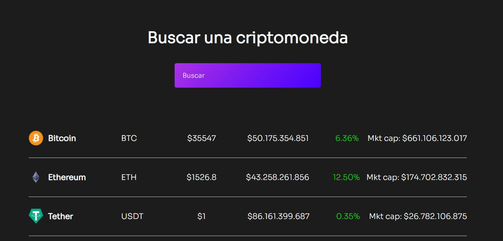

# Página web sencilla que muestra estado actual de criptomonedas

Desarrollado en React consumo de API coingecko y axios.



Para instalar aplicacion ejecutar:

```
npm install
```

Para iniciar aplicacion ejecutar

```
npm start
```

------

